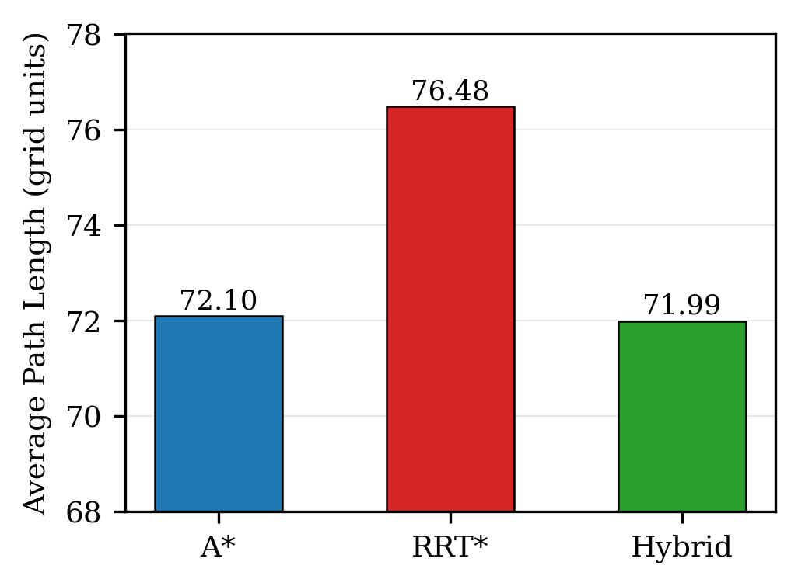
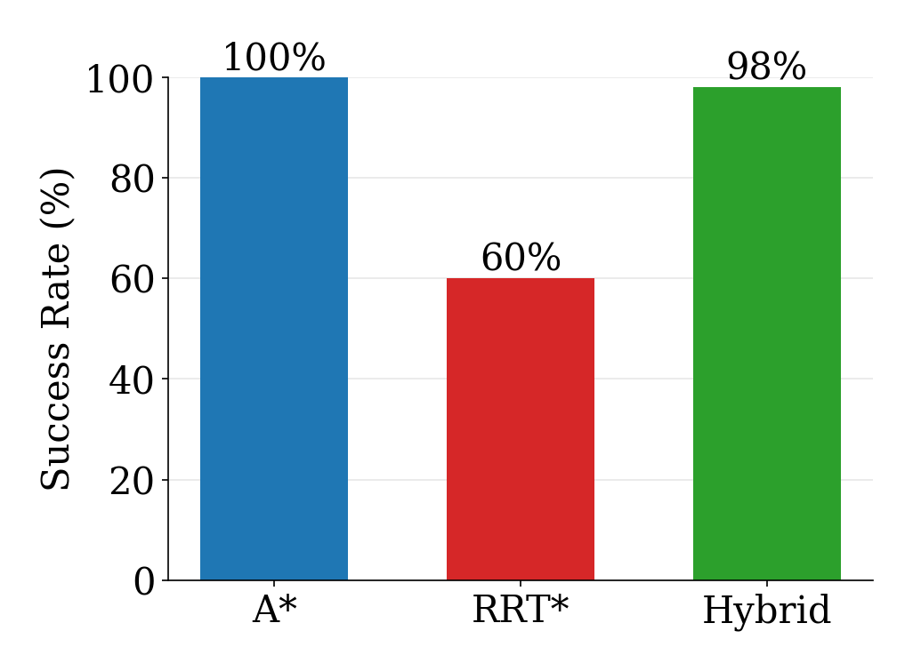
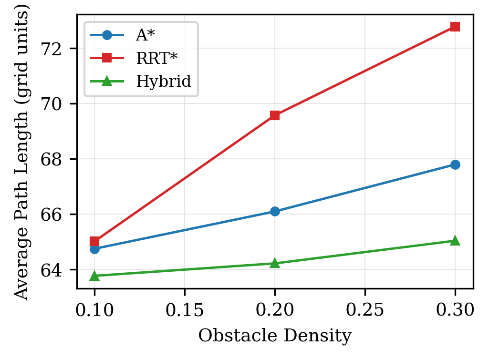
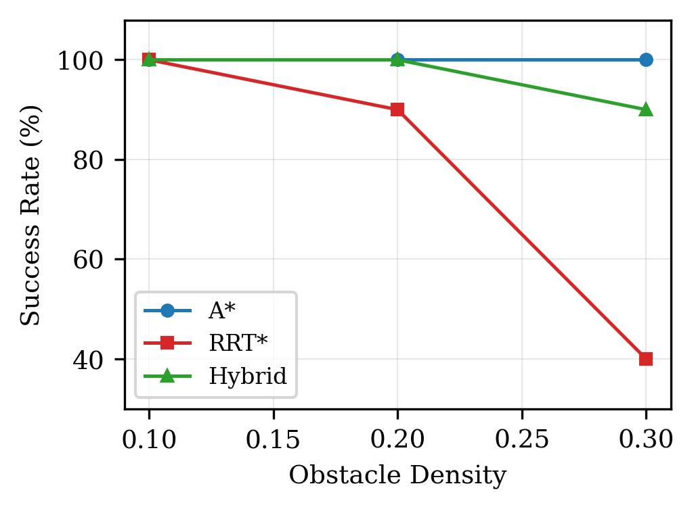
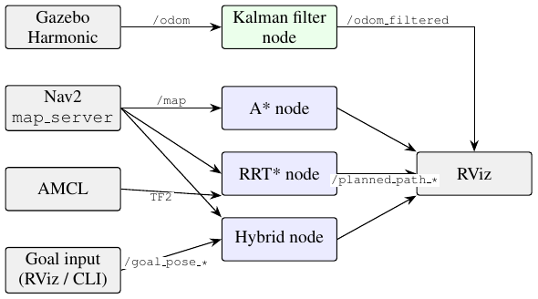

# Obstacle Avoidance and Optimal Path Planning for Autonomous Mobile Robots

### Using Sampling-Based and Graph-Based Algorithms

**Author:** Md Asifuzzaman
**Degree:** Master of Engineering Science (MES) — Electrical & Electronics Engineering
**University:** Lamar University, Beaumont, TX
**Year:** May 2026
**Thesis:** [View on ProQuest](https://www.proquest.com/dissertations-theses/obstacle-avoidance-optimal-path-planning/docview/32699575)

---

## What's in this repository

A robot trying to get from one point to another without hitting anything usually relies on one of two families of algorithm: **grid-based search** (like A\*), which is fast and reliable but produces stiff, angular paths, or **random sampling** (like RRT\*), which produces smoother paths but can't always be trusted to find a route at all — especially once the space gets cluttered.

This project builds a **hybrid planner** that gets the best of both: A\* is run first to find a rough global route, and RRT\* is then confined to a corridor around that route rather than left to search the entire map. The corridor automatically widens in cluttered areas and narrows in open space. The result, benchmarked over 50 trials at three obstacle densities, is a planner that keeps A\*-level reliability while producing paths as short as RRT\*'s.

Beyond the algorithm itself, this repository also contains a full **ROS2/Gazebo deployment** of all three planners as live, independently running nodes, plus a **Kalman filter** for cleaning up noisy robot odometry in real time — both built to test whether the algorithm actually holds up outside of an idealized offline simulation.

---

## Results at a glance

### How each planner performs (50-trial benchmark, obstacle density 0.20)

| Algorithm | Success Rate | Avg Path Length | Avg Time (s) |
|-----------|--------------|------------------|--------------|
| A* | 100% | 72.10 | 0.0025 |
| RRT* (standard) | 60% | 76.48 | 0.0992 |
| Hybrid A*+Corridor RRT* | 98% | 71.99 (**-5.87% vs RRT\***) | 0.1017 |

The headline result: standalone RRT\* only succeeds 60% of the time, but guiding it with an A\*-derived corridor pushes that up to 98% — while still producing the shortest average paths of the three.

### How that holds up as the environment gets more cluttered

At the highest tested obstacle density, standalone RRT\*'s success rate collapses to 40%. The Hybrid planner only drops to 90% over the same range, because the A\* reference path guarantees at least one feasible route always exists inside the corridor.

Full raw numbers behind these charts are in [`paper_figures/tables/`](paper_figures/tables/).

---

## Multi-Objective Optimization

The planner minimizes a combined cost index:

J = aL + bT + g(1 - S)

Where:
- L = path length
- T = computation time
- S = success rate
- a, b, g = weighting coefficients

---

## Live ROS2 Deployment

All three planners (A*, RRT*, and Hybrid) have been ported into ROS2
nodes and tested live against the nav2_bringup TurtleBot3 simulation,
using real map data (nav_msgs/OccupancyGrid) and live TF2 localization
(map -> base_link via AMCL). Each planner runs as an independent node
with its own topic pair, so all three can run side by side for direct
comparison.

All three planner nodes subscribe to the same map and AMCL-maintained
localization, but publish to planner-specific topics so they can be
compared fairly while running simultaneously. See
[`ros2_integration/planner_nodes/`](ros2_integration/planner_nodes/)
for the full ROS2 package.

**Environment:** ROS2 Jazzy + Gazebo Harmonic + Ubuntu 24.04

---

## Kalman Filter State Estimation

A constant-velocity Kalman filter node fuses live wheel odometry into a
smoothed pose and velocity estimate, publishing it as a drop-in
replacement odometry topic — this is new work extending the thesis
beyond its original scope.

Validated against a synthetic noisy circular trajectory using the
actual deployed filter class
([`ros2_integration/planner_nodes/planner_nodes/kalman_filter.py`](ros2_integration/planner_nodes/planner_nodes/kalman_filter.py)),
achieving a **39.8% position-error reduction** (RMSE) versus the raw
noisy measurements. Fully reproducible via
[`src/validate_kalman_filter.py`](src/validate_kalman_filter.py).

---

## Repository Structure

- `src/utils.py` — shared grid, geometry, and RRT* core engine
- `src/hybrid_astar.py` — Hybrid A*+Corridor RRT* planner (this thesis' novel method)
- `src/rrt_star.py` — standard RRT* baseline algorithm
- `src/demo.py` — runs all three planners and generates comparison figures
- `src/benchmark_50trials.py` — regenerates the full 50-trial statistical benchmark
- `src/validate_kalman_filter.py` — regenerates the Kalman filter validation figure
- `ros2_integration/planner_nodes/` — full ROS2 node package for all three planners + Kalman filter
- `paper_figures/` — every figure and table shown above, with captions and reproduction notes
- `docs/architecture.md` — system architecture details

---

## Installation

Clone the repository:

    git clone https://github.com/Asif-Ucchwas/hybrid-a-star-rrtstar-path-planning.git
    cd hybrid-a-star-rrtstar-path-planning

Install dependencies:

    pip install -r requirements.txt

Run the demo (generates comparison figures in src/figures/):

    cd src
    python demo.py

---

## Related Work

- IoT-Based Fault Detection System, Co-authored paper, IJSRP, July 2023
- Smartphone-Controlled Mobile Robot, 3rd place, national robotics competition

---

## Contact

- LinkedIn: https://linkedin.com/in/masifuzzaman
- GitHub: https://github.com/Asif-Ucchwas
- Email: asifuzzamanucchwas@gmail.com
