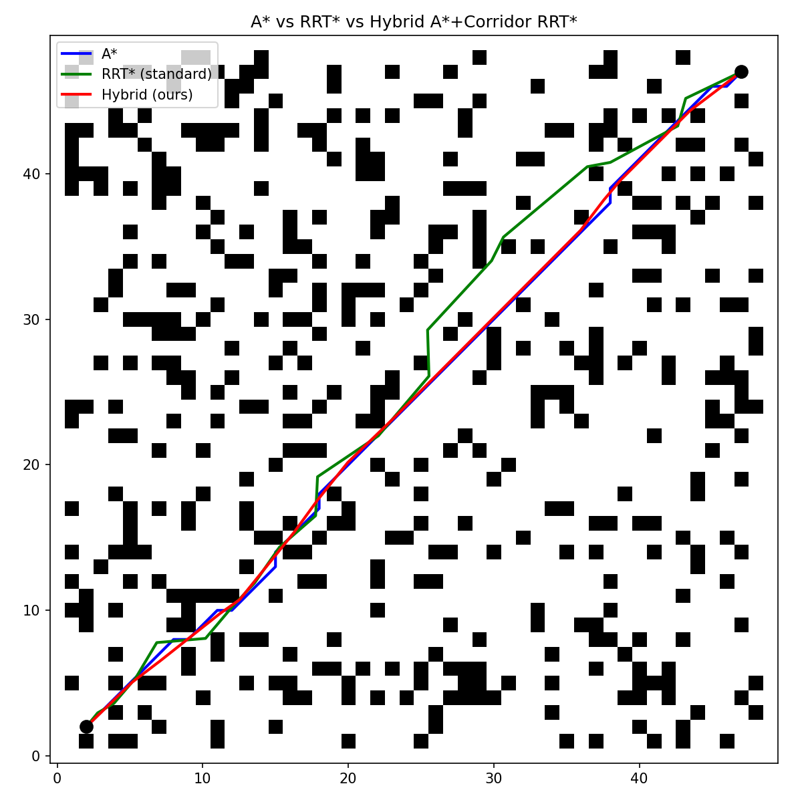
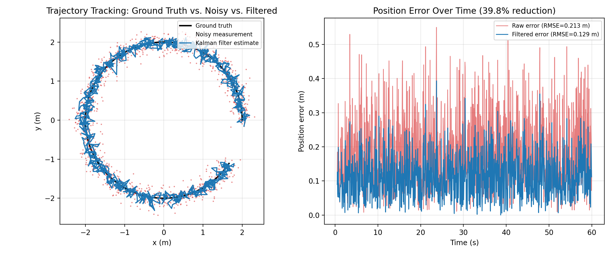

# Obstacle Avoidance and Optimal Path Planning for Autonomous Mobile Robots
### Using Sampling-Based and Graph-Based Algorithms

**Author:** Md Asifuzzaman
**Degree:** Master of Engineering Science (MES) — Electrical & Electronics Engineering
**University:** Lamar University, Beaumont, TX
**Year:** May 2026
**Thesis:** [View on ProQuest](https://www.proquest.com/dissertations-theses/obstacle-avoidance-optimal-path-planning/docview/32699575)

---

## Overview

This repository implements a hybrid motion planning algorithm that combines **A*** (graph-based) global planning with an **adaptive-corridor-guided RRT*** (sampling-based) refinement step, for autonomous mobile robots navigating obstacle-dense environments.

The hybrid approach achieves a **5.87% path-length improvement** over standard RRT* while maintaining a **98% success rate** across 50 simulation trials at three obstacle densities.

A ROS2/Gazebo extension, including real-time state estimation via a Kalman filter, is in active development as a follow-on contribution beyond the original thesis.

---

## Key Results

| Algorithm | Success Rate | Avg Path Length | Avg Time (s) |
|-----------|--------------|------------------|--------------|
| A* | 100% | 72.10 | 0.0025 |
| RRT* (standard) | 60% | 76.48 | 0.0992 |
| Hybrid A*+Corridor RRT* | 98% | 71.99 (**-5.87% vs RRT\***) | 0.1017 |

Tested across 50 simulation trials at obstacle densities: 0.10, 0.20, 0.30

---

## Multi-Objective Optimization

The planner minimizes a combined cost index:

J = aL + bT + g(1 - S)

Where:
- L = path length
- T = computation time
- S = success rate
- a, b, g = weighting coefficients

---

## Repository Structure

- `src/utils.py` — shared grid, geometry, and RRT* core engine
- `src/hybrid_astar.py` — Hybrid A*+Corridor RRT* planner (this thesis' novel method)
- `src/rrt_star.py` — standard RRT* baseline algorithm
- `src/demo.py` — runs all three planners and generates comparison figures
- `src/figures/` — output plots (e.g. comparison.png above)
- `docs/architecture.md` — system architecture details

---

## Installation

Clone the repository:

    git clone https://github.com/Asif-Ucchwas/hybrid-a-star-rrtstar-path-planning.git
    cd hybrid-a-star-rrtstar-path-planning

Install dependencies:

    pip install -r requirements.txt

Run the demo (generates comparison figures in src/figures/):

    cd src
    python demo.py

---

## ROS2 Integration

All three planners (A*, RRT*, and Hybrid) have been ported into ROS2
nodes and tested live against the nav2_bringup TurtleBot3 simulation,
using real map data (nav_msgs/OccupancyGrid) and live TF2 localization
(map -> base_link via AMCL). Each planner runs as an independent node
with its own topic pair, so all three can run side by side for direct
comparison. A Kalman filter state estimation node also fuses live
odometry (constant-velocity model) and publishes a filtered pose
estimate -- this is new work extending the thesis beyond its original
scope, built for this ROS2 deployment and the planned journal paper.

See ros2_integration/planner_nodes/ for the full ROS2 package.

Environment: ROS2 Jazzy + Gazebo Harmonic + Ubuntu 24.04

---

## Related Work

- IoT-Based Fault Detection System, Co-authored paper, IJSRP, July 2023
- Smartphone-Controlled Mobile Robot, 3rd place, national robotics competition

---

## Contact

- LinkedIn: https://linkedin.com/in/masifuzzaman
- GitHub: https://github.com/Asif-Ucchwas
- Email: asifuzzamanucchwas@gmail.com

## Kalman Filter Validation

Synthetic circular-trajectory validation using the deployed constant-velocity Kalman filter (`ros2_integration/planner_nodes/planner_nodes/kalman_filter.py`), achieving a **39.8% position-error reduction** (RMSE) versus raw noisy measurements. Fully reproducible via `src/validate_kalman_filter.py`.
